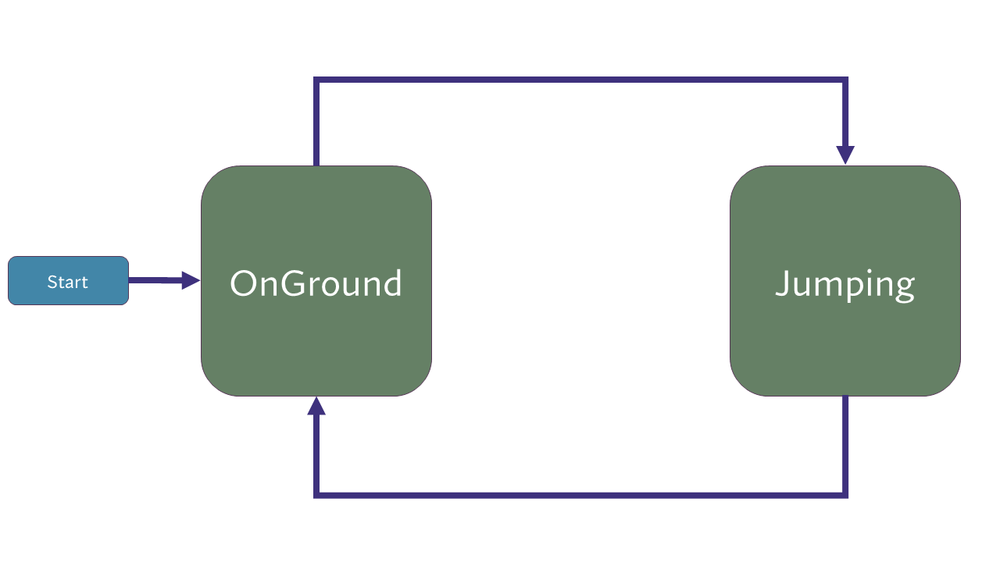
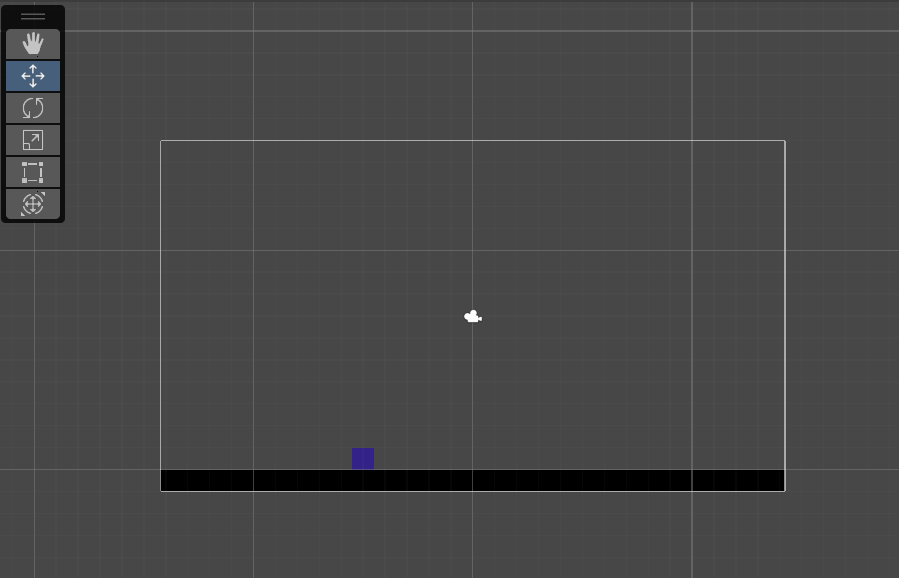
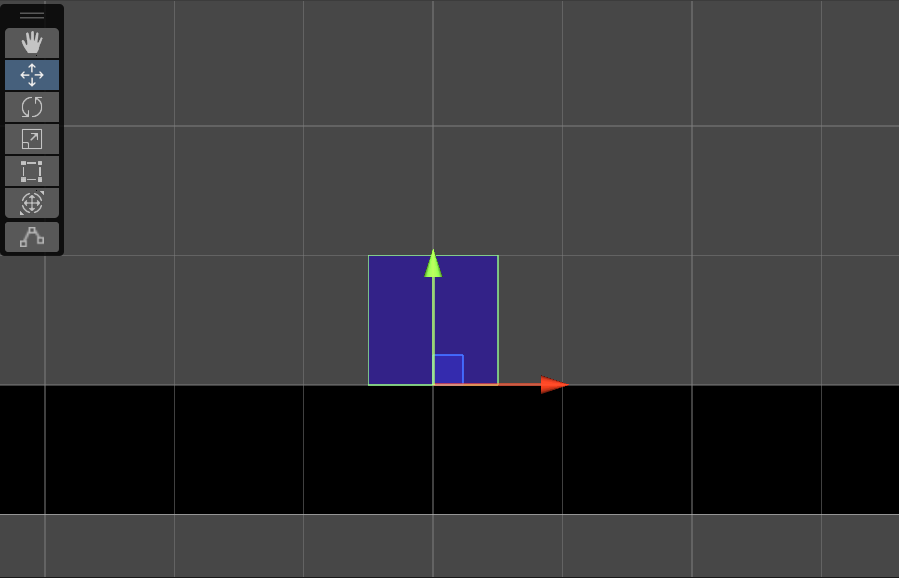
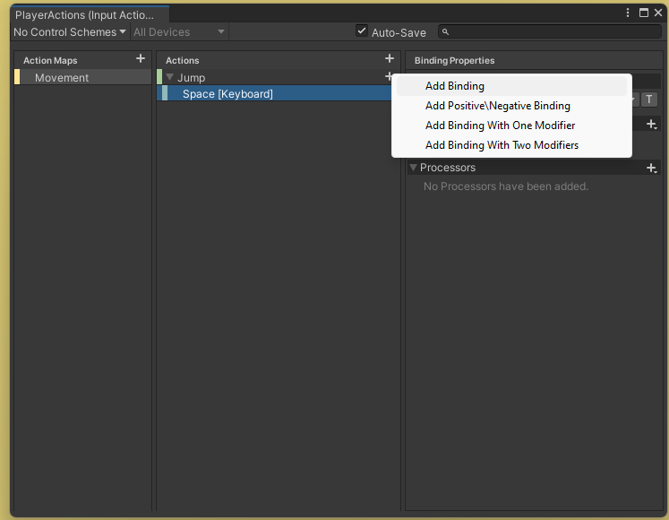
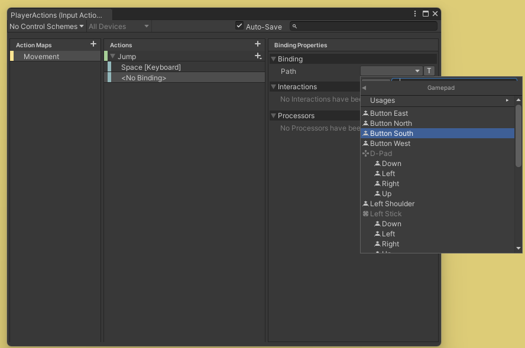
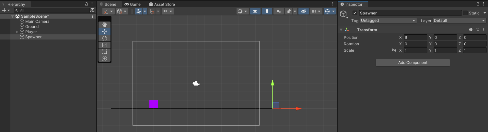
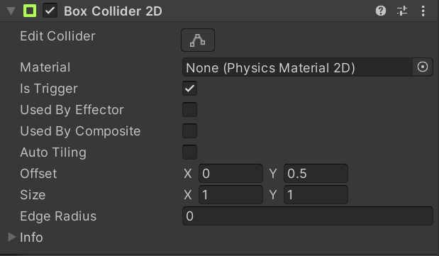
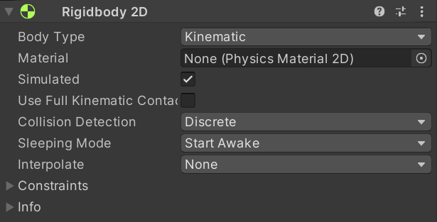
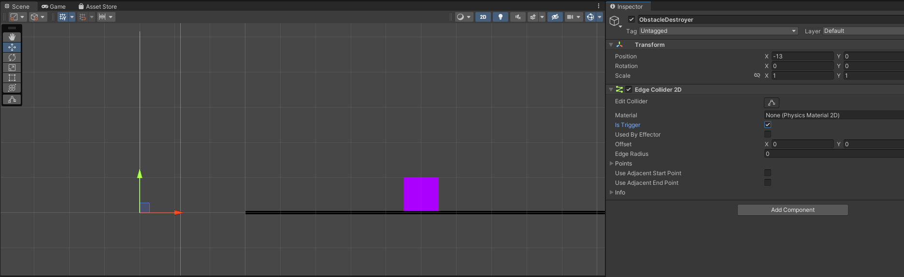

# COMP2160 Prac 03: Endless Runner

## Topics covered:
* Discussion: UN SDGs and Game Development
* Prefab instantiation, destruction
* Finite State Machines
* Collision with Trigger Colliders

> ## Discussion: UN Sustainability Goals (15 min)
> Your demonstrator will assign your group one of the [17 UN Sustainability Goals](https://sdgs.un.org/goals). In your group, you must:
> - Brainstorm and discuss how this goal is relevant to game development, be it a contribution to achieving these goals, or a determient to it (e.g., how does consumption of hardware for game dev impact goal 12?).<br><br>
> - Find a journalistic (such as a news article) or industry source (such as a press release or dev blog) that offers an example relevant to the games industry and your assigned goal.<br><br>
> - Share with the class!

## Today's Task

In this prac you will implement an endless runner game: 
https://uncanny-machines.itch.io/comp2160-week-03-prac
 
The player controls the purple square using the space key on a keyboard, or the South button on a gamepad, to jump over the triangles (or die!)


## Step 1 – Simple jumps (15 min)
First we need to implement a jumping mechanic using a state machine. We will start with simple behaviour: the jump starts when you first press the button, and ends when you hit the ground. Get out your notebook and start drawing out your state machine as we go.

We start with two states:
* The player starts in the `OnGround` state and stays in this state until the jump button is pressed. 
* When the jump button is pressed,  they enter the `Jumping` state and start moving upwards with a specified jumping velocity. Gravity is applied for each frame while they are jumping, eventually making the velocity negative, so that they return to the ground (i.e. height = 0). At this point, they return to the `OnGround` state.



The project already has a scene containing the ground and the player sprite (both using square sprites):

 

Notice that the sprite is set-up so that its pivot is at the bottom instead of the centre. This is the point we will use to measure the height of the sprite above the ground, and the calculation is simpler if we measure from this point. Moving the pivot is achieved by making the Player object an empty object and the sprite as a child of this object, with Y offset of 0.5. If you are not sure how this works, take a minute to examine the object in the heirarchy. Remember our discussion of coordinate frames from last week.


 
For simplicity's sake, the Input for this project has already been set-up. Jump is currently set to SpaceBar.

In the provided Jump script, follow the FSM pattern described in lectures to create a jumpState enumeration with two values: OnGround and Jumping.

```
private enum JumpState
{
    Jumping,
    OnGround,
}
private JumpState jumpState;

```
We also want to have a few variables, which you can set-up yourself:

* A ```jumpSpeed``` parameter for tuning in the inspector.
* A ```gravity``` parameter for tuning in the inspector.
* A private ```speed``` variable which we will manipulate in our states.

In your Update method, start writing out your state machine. Creating a sort of "template" to fill in with details will help you keep track of your different states.  For now, it should look something like this:

```
void Update()
{
    switch (jumpState)
    {
        case JumpState.OnGround:
            break;
        case JumpState.Jumping:
            break;
    }
}
```

The player should start in the `OnGround` state, so its speed should be zero. First, set the state in the Start() method:

```
jumpState = JumpState.OnGround;
```

Then, there are two things we need to add to our `OnGround` state: we need to set the speed variable, and figure out how to transition from `OnGround` to `Jumping`. We'll let you take care of the former. 

For jumping itself, we need to decide if we want to take an event-driven or polling approach to handling inputs here. There is no exact right answer, but generally speaking, if we are using explicit state machines we want to handle our transitions inside of them as much as possible. An event-driven approach would necessitate, well, events. So, we're going to use polling here.

Button inputs in Unity can be read as values. Much like we did with our movement in Prac 2, we can simply read the value of the button (returning a float of either 0 for not pressed or 1 for pressed). We will then use this info to transition into the Jumping state, setting any values we need to along the way:

```
case JumpState.OnGround:
    speed = 0;
    if (jumpAction.ReadValue<float>() > 0)
    {
        jumpState = JumpState.Jumping;
        speed = jumpSpeed;
    }
    break;
```

With what we've just done in mind, it's time to write the Jumping state. While in the Jumping state, the speed field should be updated every frame to adjust for gravity: 

```
speed += gravity * Time.deltaTime;
```

We then need to figure out how we'll transition from Jumping back to OnGround. We want this to occur when the player reaches the ground, and reset their position to stop them from falling through the floor. Add the following code to your Jumping state:

```
if (transform.position.y < 0)
{
    transform.position = new Vector3(transform.position.x,0,transform.position.z);
    jumpState = JumpState.OnGround;
}
```

Finally, we need to actually do something with all these values! Add some code to your Update method so the player moves on each frame (using transform.Translate) according to its current speed.

Play your game and test this. Tune the jumpSpeed and gravity parameters until you are happy with them.

### Better inspector parameters
Once you've got a good jump, you should have a bit of an idea as to what the min and max for both jumpSpeed and gravity should be. To help guide any designer that might be working with you on the project, you can turn these parameters in the inspector into sliders with set ranges quite easily. Try adding the following to your parameters in your Jump script, swaping out the provided values with whatever you see fit:

```
[Range(0,10)] [SerializeField] private float jumpSpeed;
[Range(0,10)] [SerializeField] private float gravity;
```
### Adding a gamepad
Spacebars are cool and all, but gamepads are where it's at. You will be provided a gamepad by your demonstrator (ask for one if not). Plug it into your computer, then edit your InputActionsAsset to have Gamepad support. First, open the InputActionsAsset and select the Jump Action. Then, press the "+" symbol to the right and select "Add Binding". This will allow you to add an additional binding to this action.



Once the binding is added, set it to the South Button on the Gamepad (or something else) by navigating to **Gamepad > South Button**. Make sure the asset is saved, and test this out. Having multiple inputs is often good for accessibility, and allows you to target other platforms.



## Checkpoint! Save, commit and push your work now.

## Step 2 – Spawning triangles (20 min)
We’re going to fake the ‘running’ part of the game by keeping the player in one position and firing triangles at it. This means we don’t have to worry about the player getting further and further away from zero. Working near (0,0,0) in world coordinates gives us the best floating-point resolution for calculations, and is common in games of this type.

Create an empty game object named "Obstacle" and add the triangle sprite to it. Turn it into a prefab. You can find the triangle sprite, along with a few other shapes, in the Sprites folder. As with the player, it will be helpful if the pivot is at the bottom of the triangle.

When selecting the colour of the Obstacle, you want to make sure it nicely contrasts with the player and the background, so that all three elements stand as seperate from one another. I like to use [David Nichol's Coloring for Colorblindness](https://davidmathlogic.com/colorblind/) to pick palettes that are as accessible.

Write a script that moves the obstacle to the left at a constant speed. I am calling mine "Obstacle", and this name will be used in the below examples. Add this to the prefab.

Make an empty Spawner object, sitting just outside the camera view on the right-hand side, with a y position of 0. This is where we will spawn the Obstacles:



We want to instantiate a new Obstacle every few seconds, with some randomness between each spawn. First, we need to link up the Obstacle with our Spawner. Create a new Spawner script and add the following:

```
[SerializeField] private Obstacle obstacle;
```
We need a function for spawning Obstacles. Create a new function in our Spawner script ("Spawn" is a good name) and add code to Instantiate the obstacle prefab. As we want to manipulate it after spawning it, we need to be sure to give it a name like "newObstacle":

```
Obstacle newObstacle = Instantiate(obstacle);
```

We then want to ensure the following:

* The New Obstacle is spawned right where the spawner is.
* The New Obstacle is a child of the Spawner.

There's a couple of ways to achieve this. Have a look at the [Unity Documentation for Instantiate()](https://docs.unity3d.com/ScriptReference/Object.Instantiate.html) to get some ideas. Is it better to do this as a single method call, or through multiple lines of code? What might be some tradeoffs? Hint: if you don't want to mess with rotation, setting it to [Quaternion.identity](https://docs.unity3d.com/ScriptReference/Quaternion-identity.html) is a pretty good idea).

### Timely triangles
We want our triangles to spawn regularly over the game, with a set interval between each one.

To achieve this spawning, we need a few variables. First, declare a paramater to set the time delay between triangle spawns. You'll also want a private timer variable which will count down between triangle spawns:

```
[SerializeField] private float timeDelay;
private float timer;
```

Your job is to now implement the next few steps in code. Call over your demonstrator if you get stuck:

* First, we want to set our `timer` to whatever value `timeDelay` is. What method does this go in?
* In our Update method, we reduce `timer` by Time.deltaTime at the beginning of each frame. Try this yourself, and don't forget to print it to the console to check what you are doing is correct.
* Then, we want to call our `Spawn()` method once the timer reaches zero. How might you use an if statement in your `Update()` method to achieve this?
* The last step is to add code into our `Spawn()` method so the timer resets when it hits zero.

> Optional: <br>For a bit more modulation, use ```RandomRange()``` to have the time between spawns vary. Make the min and max timers paramaters that can be tuned in the Inspector.

### Checkpoint! Save, commit and push your work now.

## Step 3 – Handling collisions (20 min)
We now want something to happen when our player hits an obstacle!

We’re going to use Triggers to detect collisions. Trigger colliders are used to detect collisions when you don’t need to simulate the physics of the collision. In this case, we just need to know when the player touches an obstacle, so we don’t want to use the physics engine to simulate the outcome.

Add appropriate Collider2D components to both the Player and Obstacle prefabs. Make sure both have "Is Trigger" ticked:



Whenever we move an object, we want it to have a rigidbody, as this tells Unity that these things move. Collisions are not guarantteed to be correctly calculated otherwise. Add Rigidbody2D components to both the Player and Obstacle prefabs.

By default, rigidbodies have Dynamic Body Types, which means that they are controlled by the Unity physics engine. As we will control the objects directly using Transform, we want to instead set the Body Type to Kinematic:

 

Kinematic rigidbodies detect collisions but leave it up to the programmer to decides what happens.

### Destroying the player
When colliding with a 2D trigger collider, the `OnTriggerEnter2D()` event is sent to all of its MonoBehaviours. We can use this to destroy the Player when they collide with an Obstacle. Add the following to your Jump script:

```
void OnTriggerEnter2D(Collider2D collider)
{
    Destroy(gameObject);
}
```

Test this to make sure everything is working.

### Destroying the obstacles
We also want the Obstacles themselves to be destroyed once they leave the screen. To do this, we will use an empty object to the left with a trigger collider on it like this:



The OnTriggerEnter2D method receives the Collider2D component for other object involved in the collision. Therefore, we can make our Obstacle Destroyer destroy the gameObject attached to whatever collided with it:

```
void OnTriggerEnter2D (Collider2D collider)
{
    Destroy(collider.gameObject);
}
```

### Checkpoint! Save, commit and push your work now.

## Step 4 – More complex jumps (30 min)

The jump we've created is very "floaty"! Let's add some nuance to our state machine to make the jump feel better. These jumps can be a little bit tricky to implement. As we move throug the three extra states we are going to add, try working them out on pen-and-paper. Always keep paper and a pen next to you when programming. Sketching things out on paper before writing code will help a LOT.

### Hold to jump higher
We want the player to jump higher depending on how long they hold the jump button down. This can be achieved by having a stage at the beginning of the jump in which the player rises at a constant speed until either they release the jump button, or the timer runs out (to prevent them going up forever).

Think about how you'd achieve this and sketch it out in your state machine drawing.

### Capping the fall rate
If we jump very high, we will come down very quickly. Usually we want to cap out the falling speed at some maximum value, to make sure falling isn’t uncontrollably fast. We can do this by adding an extra state to our state machine. When the falling velocity reaches terminal velocity, we enter a new state in which gravity is not applied.

Think about how you'd achieve this and add it to your state machine drawing.

### Hover time
At the top of our jump, if the player is still holding the Jump button, it is common to allow them to hover for a period of time before they start falling (either when the button is released, or when a timer runs out).

Think about how you'd achieve this and add it to your state machine drawing.

Using your sketch and notes as a guide, implement these three states. Do so one at a time, and remember to test as you go.

### Vary triangle size
Let's vary the size of the obstacles to challenge the player. When a new obstacle is spawned, scale it to a random range. Check the [Transform documentation](https://docs.unity3d.com/ScriptReference/Transform.html) for some clues.

### Prac Complete! Save, commit and push your work now.

### To receive full marks, show your tutor:

* Your completed state machine, including your diagram/notes!
* Your tunable parameters in the inspector, and how they influence your jump.
* Your spawner and destroyer.
* Your randomised triangle sizes.    

## Bonus: Juice and Effects

If you finish early, here are a few things you can experiment with:

* Add a rotation (what axis?) on your player sprite so they spin in the air when they jump.
* Add a [line-renderer](https://docs.unity3d.com/Manual/class-LineRenderer.html) to the square to give a sense of motion.
* Add large, slow moving triangles that are a different colour and deal no damage to the player that spawn behind the player and obstacles. This will give a sense of depth and is a form of [parallax scrolling](https://www.youtube.com/watch?v=piaQBAkqzhs).